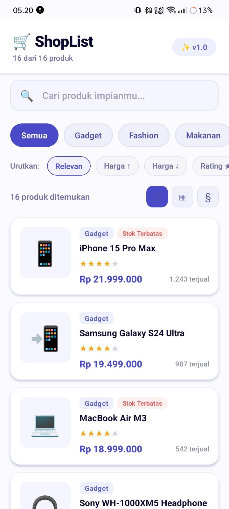
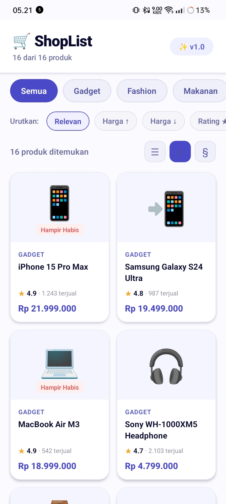
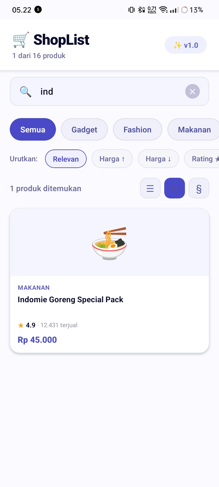
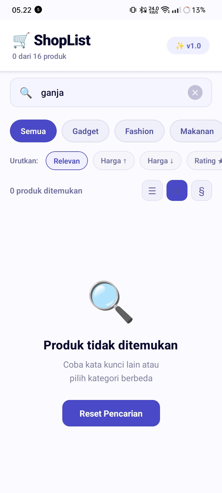

# ShopList App - Pemrograman Mobile Pertemuan 6

## Nama & NIM
- Nama: Eykel Agitha Kembaren
- NIM: 243303621275

## Deskripsi Singkat
ShopList adalah aplikasi katalog produk mini yang dibangun dengan React Native & Expo. Menampilkan 16 produk dummy dalam 4 kategori (Gadget, Fashion, Makanan, Buku) — lengkap dengan search real-time, filter kategori, sort produk, toggle tampilan list/grid/section, dan pull-to-refresh.

---

## Fitur yang Diimplementasikan

### Required (R1–R6)
- [x] **R1** — FlatList dengan 16 produk (tiap produk punya: id, name, category, price, rating, image, sold, stock)
- [x] **R2** — Custom `ProductCard` component di file terpisah `components/ProductCard.js`
- [x] **R3** — `keyExtractor` menggunakan `item.id` (string unik, bukan index)
- [x] **R4** — `ListEmptyComponent` informatif: icon + pesan + hint + tombol "Reset Pencarian"
- [x] **R5** — Search real-time dengan `TextInput` — list update tiap karakter diketik
- [x] **R6** — Pull-to-Refresh dengan `onRefresh` & `refreshing` props bawaan FlatList

### Bonus (E1–E4)
- [x] **E1 (+10)** — Filter Kategori: chip horizontal (Semua / Gadget / Fashion / Makanan / Buku), dikombinasikan dengan search via `useMemo`
- [x] **E2 (+10)** — Toggle List / Grid View: tombol toggle antara tampilan 1 kolom ↔ 2 kolom menggunakan `numColumns`
- [x] **E3 (+5)** — SectionList Mode: tombol `§` untuk beralih ke tampilan produk dikelompokkan per kategori
- [x] **E4 (+5)** — Sort Produk: Relevan / Harga ↑ / Harga ↓ / Rating ★

---

## Screenshot

### Tampilan Utama (List Produk)
> 

### Tampilan Grid (2 Kolom)
> 

### Tampilan Search — saat ada hasil
> 

### Tampilan Empty State — saat tidak ada hasil
> 

### Tampilan SectionList Mode
> !

---

## Struktur Folder

```
ShopList-App/
├── App.js                    ← Entry point
├── README.md
├── data/
│   └── products.js           ← 16 produk dummy + helper formatPrice
├── components/
│   ├── ProductCard.js        ← Card component (list & grid mode)
│   └── SearchBar.js          ← Search bar dengan tombol clear ✕
└── screens/
    └── HomeScreen.js         ← Semua logika utama (state, filter, render)
```

---

## Cara Menjalankan

1. Clone repo  : `git clone [url-repo-kamu]`
2. Masuk folder: `cd ShopList-App`
3. Install deps: `npm install`
4. Jalankan    : `npx expo start`
5. Scan QR Code dengan **Expo Go** di HP

> **Expo Snack**: [https://snack.expo.dev/@eykel21/shoplist-app]

---

## Teknologi yang Digunakan

| Teknologi | Versi |
|-----------|-------|
| React Native | 0.74+ |
| Expo | SDK 51 |
| JavaScript | ES2022 |

---

## Catatan Teknis

- Filter kategori + search dikombinasikan dengan `useMemo` agar tidak ada re-render berlebih
- `numColumns` pada FlatList menggunakan `key` prop yang berbeda (`'grid'` / `'list'`) untuk menghindari error saat toggle
- SectionList menggunakan data terpisah yang diolah dari hasil `filteredProducts` yang sudah ter-filter
- `RefreshControl` digunakan di keduanya (FlatList & SectionList) agar pull-to-refresh konsisten
- Semua style menggunakan `StyleSheet.create` — tidak ada inline style di JSX
